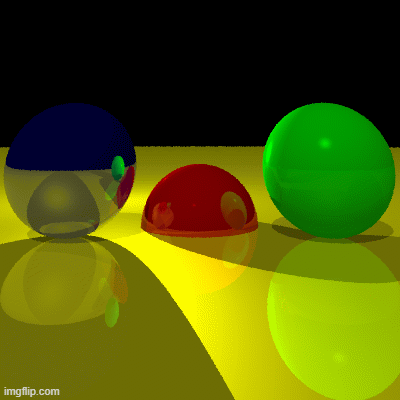
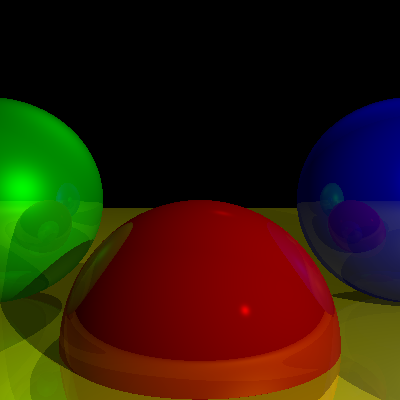
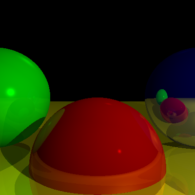

# Basic Ray Tracer project

Projekt symulujący działanie technologii Ray Tracing napisany w języku Python jako projekt zaliczeniowy z przedmiotu "Programowanie w języku Python" na AGH w roku akademickim 2022/23. Do stworzenia projektu nie zostały wykorzystane żadne zewnętrzne biblioteki poza tymi z biblioteki math (pierwiastek, potęga itp.). Obrazy są obliczane matematycznie i zapisywane do pliku .ppm (piksel mapy).


## Demo




## Funkcje programu

- Możliwość ustawienia własnej sceny, dodania obiektów do sceny
- Możliwość ustwienia pozycji kamery i jej skierowania w odpowiedni punkt
- Antyaliasing
- Efekt szkła, odbicia światła i cienie
- Własna implementacja zapisu do formatu PPM


## Optymalizacje

What optimizations did you make in your code? E.g. refactors, performance improvements, accessibility


## Instalacja

Instalacja wymaga jedynie sklonowania repozytorium 'git clone'

```bash
  git clone my-project
  cd my-project
```
    
## Przykładowe obrazy

 </br>



## Technologie

Pure Python 3.11


## Autorzy

- [@Panyloi](https://github.com/Panyloi) Hieronim Koc
- [@krzychsol](https://github.com/krzychsol) Krzysztof Solecki

